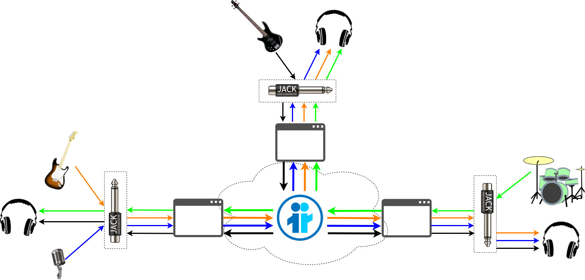

(pre-alpha) JamRTC -- Jam sessions with Janus!
==============================================

This is an attempt to create a simple prototype for doing jam sessions using WebRTC as a technology, and in particular taking advantage of [Janus](https://github.com/meetecho/janus-gateway/) as an open source WebRTC server for the purpose. The main reason why this effort uses Janus and not P2P or another server is simply that I'm the main author of Janus itself, and so that's what I'm most familiar with: you're of course free to try and come up with different attempts that use different backends, or no backend at all (the more we use WebRTC to help music, the better!).

It's very early stages, and mostly meant as a playground for interested developers, musicians and more in general tinkerers, to experiment whether it's a viable road or not.

# Motivation

In 2021, I made a presentation at [FOSDEM](https://fosdem.org/2021/) called [Can WebRTC help musicians?](https://fosdem.org/2021/schedule/event/webrtc_musicians/), which tried to go through some common music-based scenarios, and how WebRTC could possibly help implement them on the Internet when real-time communication is required, especially in light of the impact the COVID pandemic had on the music world. The presentation was mostly an overview, and probably asked more questions than it answered, but it did contain a section on jam sessions as a key scenario WebRTC might help with, considering the real-time nature of the technology.

It started from a few assumptions, they most important one being that browsers (usually the main target for WebRTC applications) are not a good device for participating in a jam session: in fact, the audio pipeline they implement presents some obstacles, like too much tinkering with the audio they capture (AGC, AEC), too much latency (integrated buffers and synchronization mechanisms), no way to easily capture generic devices (made for generic microphones, mostly), and no way to interact with lower-latency audio systems on the operating system (e.g., the [JACK Audio Connection Kit](https://github.com/jackaudio)). As such, the idea was to try and come up with a native application instead, in order to attempt to overcome the obstacles above. This is what this repo is trying to provide a foundation for.

### Why not Jamulus, Jacktrip, `<insert your favourite tool here>`?

This effort is not trying to replace anything, let alone well known applications: for instance, while I never used it, I'm well aware that Jamulus is very widespread among musicians, who use it successfully every day. Heck, I even thought of calling this project "JAMus" (as in Jam over Janus) and then changed my mind because it sounded too much like Jamulus itself! :grin:  The only purpose of this project is to experiment with whether or not WebRTC (which the other tools are not built upon) can also help build something comparable in terms of requirements, especially considering there's advantages in having WebRTC as part of the stack in a scenario like this: if it grows into something more than that, then great, but that's not the point.

If you're looking for something you can use RIGHT AWAY and is known to work great, then Jamulus or a similar application is indeed what you should use! If you're curious about WebRTC and music, then this is a good place to experiment with that, knowing it's not much more than a toy right now.

### Why WebRTC?

Why not? :grin:  Jokes apart, the main reason is that, as technology, WebRTC should be suited for the job, since it's main purpose is exchanging live audio/video/data streams in real-time. While it's mostly used for traditional use cases like conferencing, streaming, and stuff like that, the tools are there to do something in the "creative" department as well.

Apart from that, there are some other advantages in using WebRTC for the job. If the music streams you're exchanging are WebRTC-based, e.g., via an SFU like the Janus VideoRoom or others, then it's very easy to distribute the same streams to "traditional" endpoints as well, like browsers, mobile endpoints, or others. This means you could build a simple web app to serve a small or larger audience, for instance, whose requirements for super-low latency would not be the same as those of the players involved. At the same time, WebRTC streams are easy to integrate in other frameworks for further processing, e.g., for mixing, processing, transcoding, or broadcasting purposes, which make them a useful tool for additional requirements and use cases: you can find some examples in a [Janus Workshop](https://www.youtube.com/watch?v=uW8ztFCkxVk&pp=qAMBugMGCgJpdBAB) I did at ClueCon TGI2021 ([slides](https://www2.slideshare.net/LorenzoMiniero/janus-workshop-pt2-cluecon-2021)).

# Architecture

As anticipated, the main idea behind this effort was to try and write a native WebRTC application to optimize the process as much as possible, especially where latency is involved. I decided to base this on @GStreamer 's [webrtcbin](https://gstreamer.freedesktop.org/documentation/webrtc/?gi-language=c), for a few different reasons:

* I already had a bit of experience with it, having used it briefly in a couple of other projects;
* GStreamer comes with a great set of plugins for decoding, encoding and rendering media;
* GStreamer has dedicated plugins to interact with JACK as well;
* it's relatively easy to build a GUI on top of GStreamer's building blocks (I used GTK+ 3.0, here).

At the same time, I wanted to use Janus as a reference server for all endpoints engaged in a session. This led to the diagram you can see below:



In a nutshell, the idea was to have this GStreamer-based native application join a Janus [VideoRoom](https://janus.conf.meetecho.com/docs/videoroom), and then:

1. publish media to the server (e.g., your guitar and your webcam/mic);
2. subscribe to media from other participants (e.g., drum and bass player) via the same server.

I conceived the application to not only allow you to share musical instruments, but also to have a parallel channel to interact with the other participants. As such, by default when launching JamRTC it will create two WebRTC PeerConnections: one to send your webcam + microphone, and another to send your instrument as an audio-only stream; of course you can choose whether you want to publish everything, just something, or nothing at all. When other participants join the session, the tool is conceived to automatically subscribe to whatever they're sharing: all the feeds are then rendered in a very simple (and super-ugly) UI, where audio streams are visualized via a wavescope.

It's important to point out that, when using JACK as the audio backend, JamRTC is conceived not to automatically pick the devices to capture: this is up to you to do, by creating the connections you want manually. I'll get back to this later on, when explaining how to test what's currently there.

# Building JamRTC

The main dependencies of JamRTC are:

* [GLib](http://library.gnome.org/devel/glib/)
* [pkg-config](http://www.freedesktop.org/wiki/Software/pkg-config/)
* [GStreamer](https://gstreamer.freedesktop.org/) (>= 1.16)
* [GTK+ 3](https://www.gtk.org/)
* [Glade](https://glade.gnome.org/)
* [libwebsockets](https://libwebsockets.org/)

Make sure the related development versions of the libraries are installed, before attempting to build JamRTC, as to keep things simple the `Makefile` is actually very raw and naive: it makes use of `pkg-config` to detect where the libraries are installed, but if some are not available it will still try to proceed (and will fail with possibly misleading error messages). All of the libraries should be available in most repos (they definitely are on Fedora, which is what I use everyday, and to my knowledge Ubuntu as well).

Once the dependencies are installed, all you need to do to build JamRTC is to type:

	make

This will create a `JamRTC` executable. Trying to launch that without arguments should display a help section:

```
[lminiero@lminiero JamRTC]$ ./JamRTC
Usage:
  JamRTC [OPTION?] -- Jam sessions with Janus!

Help Options:
  -h, --help              Show help options

Application Options:
  -w, --ws                Address of the Janus WebSockets backend (e.g., ws://localhost:8188; required)
  -r, --room              Room to join (e.g., 1234; required)
  -d, --display           Display name to use in the room (e.g., Lorenzo; required)
  -M, --no-mic            Don't add an audio source for the local microphone (default: enable audio chat)
  -W, --no-webcam         Don't add a video source for the local webcam (default: enable video chat)
  -v, --video-device      Video device to use for the video chat (default: /dev/video0)
  -i, --instrument        Description of the instrument (e.g., Guitar; default: unknown)
  -s, --stereo            Whether the instrument will be stereo or mono (default: mono)
  -I, --no-instrument     Don't add a source for the local instrument (default: enable instrument)
  -b, --jitter-buffer     Jitter buffer to use in RTP, in milliseconds (default: 0, no buffering)
  -c, --src-opts          Custom properties to add to jackaudiosrc (local instrument only)
  -S, --stun-server       STUN server to use, if any (hostname:port)
  -T, --turn-server       TURN server to use, if any (username:password@host:port)
  -l, --log-level         Logging level (0=disable logging, 7=maximum log level; default: 4)
  -J, --no-jack           For testing purposes, use autoaudiosrc/autoaudiosink instead (default: use JACK)
```

# Running JamRTC

At the moment, you can only customize the behaviour of JamRTC at startup, via command-line arguments, as there are no visual settings in the GUI or parameters you can tweak dynamically. This means that there are some required arguments to start the tool, namely:

* The address of the WebSocket backend for the Janus instance to use;
* The unique ID of the VideoRoom to use for the session;
* The display name to use in the session.

All the other arguments are optional, and allow you to customize how you want the tool to behave. As anticipated, for instance, by default the tool will try to capture webcam and microphone (for a visual interaction with the other participants) and a local instrument: you can use the available arguments to disable any of those, and only publish what you want to send. The other arguments should be pretty self-explainatory as well.

> Note well! One important option is `-J`(or `--no-jack`). By default, JamRTC will assume JACK is running, and so will attempt to use it to both capture and render the audio streams: if you just want to test this without JACK, passing this flag will make JamRTC use `autoaudiosrc` and `autoaudiosink` instead where audio is involved, thus in theory choosing whatever you're using in your system. Take into account that this will limit the control you have on how devices are captured (`autoaudiosrc` will pick what it wants and likely not your guitar :grin: ), and that latency will probably be much higher as well.

Here's a few examples of how you can launch it.

### Connect to a local Janus instance in room 1234 as "Lorenzo" and publish everything via JACK, calling the instrument "Guitar"

	./JamRTC -w ws://localhost:8188 -r 1234 -d Lorenzo -i Guitar

### Connect to the online Janus demo to do the same

	./JamRTC -w wss://janus-legacy.conf.meetecho.com/ws -r 1234 -d Lorenzo -i Guitar

> Note that room `1234` is the default room on our online demos, and so you'll find random people in it that are just joining via their browser. As such, it's a bad idea to use that room for testing, unless you know there's no one else except you and who you want to test with. You may want to deploy your own Janus instance for testing.

### Connect to a local Janus instance in room 1234 as "Lorenzo" and publish everything, but use a different video device

	./JamRTC -w ws://localhost:8188 -r 1234 -d Lorenzo -i Guitar -v /dev/video2

### Connect to a local Janus instance in room 1234 as "Lorenzo" and only publish webcam and instrument (no microphone)

	./JamRTC -w ws://localhost:8188 -r 1234 -d Lorenzo -M -i Guitar

### Connect to a local Janus instance in room 1234 as "Lorenzo" and only publish your instrument (no microphone/webcam) as stereo

	./JamRTC -w ws://localhost:8188 -r 1234 -d Lorenzo -M -W -i Guitar -s

### Connect as a passive attendee

	./JamRTC -w ws://localhost:8188 -r 1234 -d John -W -M -I

### Connect as a passive attendee from a browser

Tinker with the default `videoroomtest.html` demo page in the Janus repo, or write your own web application for the purpose.

> Note: In case you plan to write your own web-based frontend, it's worth pointing out that JamRTC "abuses" the display field of the VideoRoom API to correlate the multiple feeds. In fact, as anticipated by default JamRTC publishes two separate PeerConnections, one for webcam+mic, and another for the instrument: in order to allow other participants they both come from you, JamRTC actually uses a JSON object serialized to string as the display used for each publisher stream. This should be taken into account when designing a web-based application, as otherwise different PeerConnections coming from the same participant would be rendered as separate participants (which is what the default VideoRoom demo will indeed do).

### The ugliest GUI you'll see today

When you start JamRTC, you should see a window that looks like this:


Quite frankly and in all self-deprecating honesty, nothing to write back home about, but as a start (and for someone who knows very little about GUI development) it's not that awful... :hand_over_mouth:

Assuming you're sharing everything, you'll see your video on top, then a visual representation of your microphone, and finally a visual representation of your instrument. In case any of those is not being shared, they just won't be there, and the related labels will be updated accordingly.

When someone else joins the session, a new column will appear with the media they're sharing instead:


I sketched the current layout with Glade, and at the moment it only accomodates four participants, whether they're active or just attendees: the moment more participants join, their media is rendered independently by GStreamer in separate floating windows. Hopefully later on this can be made more dynamic and adaptive, but that's not what I really care about right now.

As anticipated, the GUI currently is passive, meaning there's no interactive component: there's no menus, no buttons, nothing you can tweak or anything like that, what you see is what you get. Since I'm very new to GUI development, and GTK in particular, this is the best I could come up with: besides, the code itself is probably not very "separated" in terms of logic vs. rendering, so refactoring the UI may not be that easy. Anyway, feedback from who's smarter in this department will definitely help make this more usable in the future, when maybe the media itself works better than it does today!

> Note: sometimes, when people join some of their media are not rendered right away, and you have to minimize the application and unminimize it again: this is probably related to my poor UI coding skills, as it feels like a missing message somewhere to wake something up.

# Using JACK with JamRTC

As anticipated, when using JACK to handle audio, JamRTC will connect subscriptions to the speakers automatically, but will not automatically connect inputs as well: that's up to you to do, as you may want to actually share something specific to your setup (e.g., the raw input from the guitar vs. what Guitarix is processing).

Assuming you're asking JamRTC to share both microphone (for the audio/video chat) and an instrument, this is what you should see in JACK:


As you can see, there are two JACK input nodes, both of which currently not receiving input from any source. The first thing you may want to do is feed the instrument node (called "JamRTC Guitar" here) in this picture: let's connect Guitarix in this example, which is getting the raw guitar feed from my Focusrite soundcard; in order to hear what I'm playing, I'm connecting Guitarix to the speakers too. The important part is that the moment we start feeding the instrument node, it will be sent via WebRTC to the server, and so to the other participants:


Since we want to share our microphone to chat with the other participants as well, we may need an app to help with that: in this instance, in fact, the capture device is my Focusrite soundcard, which is not where my microphone is. Specifically, I want to use the microphone of my laptop, so I can use tools like `zita-a2j` to add an Alsa device as an additional capture device, e.g.:

	zita-a2j -d hw:0

At this point, I can connect the output of that to the JamRTC chat node (called "JamRTC mic"), which will as a result start sending our voice via WebRTC as well:


When other participants join, JamRTC automatically plays their contributions by connecting the related JACK notes to the speakers instead, as that's what we assume would be the main purpose:


Considering how JACK works, you're of course free to (also) connect the output to something else, e.g., a DAW.

# What's missing?

This should be very much considered a pre-alpha, as while it "works", I'm still not satisfied with it. The main issue is, obviously, the latency, which is still too high even in a local environment despite my attempts to reduce it. I'm still trying to figure out where the issue might be, as it may be either something in the GStreamer pipelines (WebRTC stack? buffers? queues? JACK integration?), in Janus (something adding latency there?) or WebRTC itself. I don't know enough about the GStreamer internals to know if anything can be improved there (I already disabled the webrtcbin jitter buffer, but not sure it helped much), so the hope is that by sharing this effort and letting more people play with it, especially those knowldedgeable with any of the different technologies involved, we can come up with something that can be really used out there.

Notice that one other known limitation is that, out of the box, this currently only works on Linux: this is because we explicitly use some GStreamer elements that may only be available there (e.g., `jackaudiosrc`, `jackaudiosink`, `xvimagesink`). This is very simply because Linux is what I use everyday and what I'm familiar with: besides, while I know JACK allows for low latency on Linux, I have no idea what is typically used on other operatng systems instead for the same purpose. Should you want to try and build this on other systems as well, you'll probably have to tweak the code a bit: of course, if you get it running on Windows and/or Mac OS, I'd be glad to have the changes contributes back to the repo!

Apart from these more fundamental aspects, there are other things I'd like to add to the tool sooner or later, in particolar related to usability, e.g.:

* being able to mute/unmute your streams (more in general, dynamic manipulation of pipeline elements);
* being able to dynamically add/remove instruments after the start;
* a UI that doesn't suck!

# Help us improve this

That's all: feedback and contributions more than welcome!

There's no group, chat or mailing list for the project, right now: I don't anticipate the need for one in the short term, but if enough people show interest, we can figure something out (maybe a room on Matrix, which worked great for FOSDEM). In the meanwhile, if you have ideas or feedback, feel free to open issues where they can be discussed, and please do submit pull requests if you fix some outstanding bug (of which there are plenty, I'm sure). There's a [thread on LinuxMusicians](https://linuxmusicians.com/viewtopic.php?p=130383) that discusses playing music online as well which you may be interested in: LinuxMusicians itself may be another venue where to discuss the tool in general, maybe in a dedicated thread.
